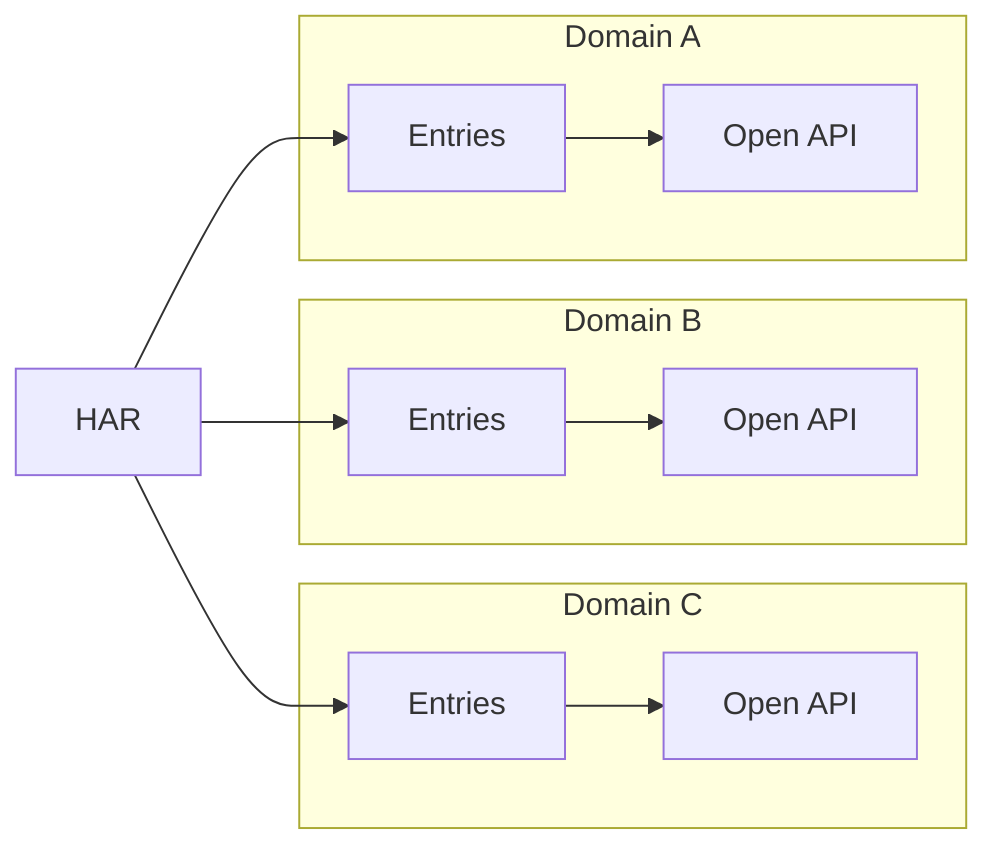

# API Explorer

API Explorer is a network viewer in the style of Open API.

## How this app works

This app convert from HAR to Open API.

## Repository template

This repository generated from [Jonghakseo/chrome-extension-boilerplate-react-vite](https://github.com/Jonghakseo/chrome-extension-boilerplate-react-vite).
